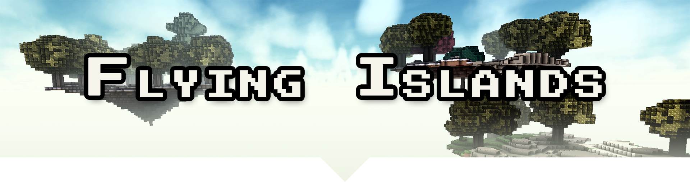

# Flying Islands

This module provides a world generation plugin that creates flying islands in the sky.
Please note, that this module also enables [`FallingBlocks`](https://github.com/Terasology/FallingBlocks) which adds gravitational effects for solid blocks. 

## Laputa Adamant

The `FlyingIslands` module comes with a new block called "Laputa Adamant".
This block is the heart piece of each flying island allowing it to fly.
Should this piece be destroyed, an island will plummet to the ground.

